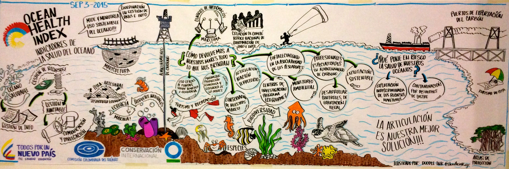

*2017 marks five years since the OHI first launched. With this short biography we reflect on its many achievements thus far as we continue to work for healthy oceans.*

 
 

The Ocean Health Index (OHI) is a scientific method and tool for channeling the best available scientific information into marine policy. 
First published in 2012 in the scientific journal *Nature*, the OHI is now used in governmental-management-academic collaborations around the world. 
Global assessments have been [endorsed by the World Economic Forum](http://www.oceanhealthindex.org/news/World_Economic_Forum_Endorses_Ocean_Health_Index), [praised by the Prince of Wales](http://www.oceanhealthindex.org/news/Colobian_Leadership_on_Oceans), [used as an indicator by the United Nations Convention on Biological Diversity](https://www.bipindicators.net/indicators/ocean-health-index), and are expected to be an indicator in the United Nations Sustainable Development Goal 14: Life Below Water. 
OHI has also been included in United States policy to evaluate ecosystem health as part of the nation's [first Ocean Plan in the Northeast Region](https://www.whitehouse.gov/blog/2016/12/07/nations-first-ocean-plans), and independently-led assessments are ongoing [in over twenty areas](http://ohi-science.org/projects) including Canada, the Baltic Sea, Ecuador, China, Colombia, Hawaii, and New Caledonia.

Keys to its successes thus far include its inclusiveness - bringing people, teams, information, and knowledge together - and its flexibility and transparency as a marine assessment tool.

Our team is a unique academic-nonprofit partnership between the National Center for Ecological Analysis and Synthesis (NCEAS) and Conservation International that continues to push boundaries in collaborative management and scientific contexts. We bridge science and policy through OHI assessments, bringing stakeholders together with the ultimate goal of all oceans sustainably providing a range of benefits to people now and in the future.

The OHI is a useful tool across geographic jurisdictions where coastal and marine policy decisions are made. Its standardized structure is repeatable and familiar across assessment jurisdictions but it is flexible to represent the important social and ecological characteristics, values, and priorities of the area assessed.
Independent groups are able to lead assessments within their own waters, deciding what is important to measure and which data to include while building directly from the experiences and methods from other OHI assessments. 
Using the OHI framework to think critically about what is important in different contexts facilitates holistic assessments of human-ocean systems. 

'Healthy oceans' does not just mean lots of fish, happy whales, and clean water. 
It also means catching fish, watching whales, developing renewable energy, and continuing many other activities that provide jobs and revenue for coastal communities in a sustainable way.
OHI evaluates these elements of ocean health – environmental, economic, and social — in an integrated way by combining their status against sustainable targets, the pressures acting upon them and management action to counteract these pressures.

The OHI [pledged a commitment at the Our Ocean Conference](http://ourocean2016.org/commitments/#commitments-main) to provide the technical tools and assistance needed by governments and coastal resource managers to help measure and manage ocean health within their jurisdictions. 
We do this by advising independent groups and openly sharing all our instruction and methods (including data and code) online at [ohi-science.org](http://ohi-science.org), using the same tools that software developers in Silicon Valley use to work efficiently and collaboratively with data. 
Environmental science demands transparency and repeatability to increase scientific rigor, strengthen public trust, and enhance how science can inform policy, and we continue to be visible leaders of open and collaborative science. 

In 2017, we will continue to work for healthy oceans, continue to push boundaries for collaborative science and policy, and look forward to working with an ever-expanding network of ocean leaders.

 

A visualization tool summarizing an OHI workshop in Colombia in 2015. (c) Comisión Colombiana del Océano.

 

*The Ocean Health Index was developed from 2009-2012 to fill the need for a quantifiable and easily communicated method to define, measure, and evaluate ‘ocean health’. The Halpern et al. 2012 publication presented both the scientific framework and the first assessment at the global scale. This was quickly followed by assessments at smaller scales with differing data availability and spatial scales in Fiji and the US West Coast, and improvements to several global models (Halpern et al. 2015). [Many independent assessments](http://ohi-science.org/projects) have since been completed or are underway (Lowndes et al. 2015). [2016 marks the fifth year of annual global assessments](http://ohi-science.org/ohi-global), with scores representing ocean health for 220 coastal nations and territories using the best available data each year.*

 
 

**See also**: 

- [OHI scientific publications](http://ohi-science.org/resources/publications/)
- [Ongoing and completed OHI assessments](http://ohi-science.org/projects)  

**Related posts:** 

- [Five years of global Ocean Health Index scores](http://ohi-science.org/news/Global-2016-Scores)
- [New OHI publication in PeerJ](http://ohi-science.org/news/new-ohi-publication-in-peerj)
