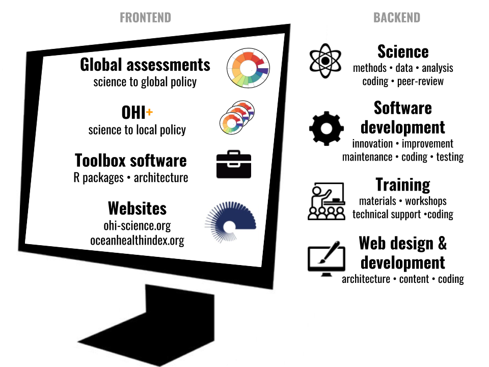

We are taking cues from Silicon Valley and using tools and practices developed specifically for working with data in a deliberate and collaborative way. And collaboration here means first with ourselves so we can remember what we did, and also with our team. Further, we're working openly by sharing our code and methods online — meaning that collaborators can be people we don't even know yet. This is huge for science, where the amount of data is increasing at an incredible rate. Not only do we need to have the right skills to analyze these data, we need to be able to communicate about what we're doing and what it all means. And to do so collaboratively. 

And luckily, Silicon Valley has figured that out for us. Do you think Twitter and AirBnB emails files like "analysis_v1b_final.xls" back and forth? No. They let powerful software take care of all the bookkeeping involved with different versions,  They have a single file, let's say it's called 'analysis.R', and 

We have been coding and using version control to make our science more reproducible. While these are not new tools, are not widely used in environmental science, and if they are, it was most likely because researchers taught themselves. But what's new is that we're using additional tools that make our 

We have a Perspective published today in *Nature Ecology & Evolution* — and it's open access!

*"Our path to better science in less time using open data science tools"* is about what we've learned by repeating OHI global assessments each year — and how we learned the hard way that we needed to change the way we worked. We describe how data science has greatly improved our science because it enables you to work more deliberately with data and streamline collaboration. We've made a website to help you to do better science in less time too:  [ohi-science.org/betterscienceinlesstime](http://ohi-science.org/betterscienceinlesstime)

It’s been game-changing for our science and how it is used for management. 

We’re sharing our story to try to inspire others to use better practices and tools too. We don’t have time to stick to our old ways when we could all be so much more effective. 

We want others to see themselves in this future and become a part of it. 

We are using the same tools that make Silicon Valley so innovative, which means we’ve embraced collaborative coding and data science. 

Coding and version control are things you may have heard of. Coding lets you create a reusable record of the analyses you’ve done, and version control takes care of all the bookkeeping that you’d otherwise do, like model_v1.R and model_v1b.R. This is super powerful.

**Citation**  

[Lowndes JSS, Best BD, Scarborough C, Afflerbach JC, Frazier MR, O'Hara CC, Jiang N, Halpern BS (2017). Our path to better science in less time using open data science tools. *Nature Ecology & Evolution*, ](). 

 

**See also**: 

- [Resources for better science in less time](http://ohi-science.org/betterscienceinlesstime)  
- [OHI scientific publications](http://ohi-science.org/resources/publications/)

**Related posts:** 

- [The importance of open data science tools in science: a list of references](http://ohi-science.org/news/importance-of-open-data-science-tools)