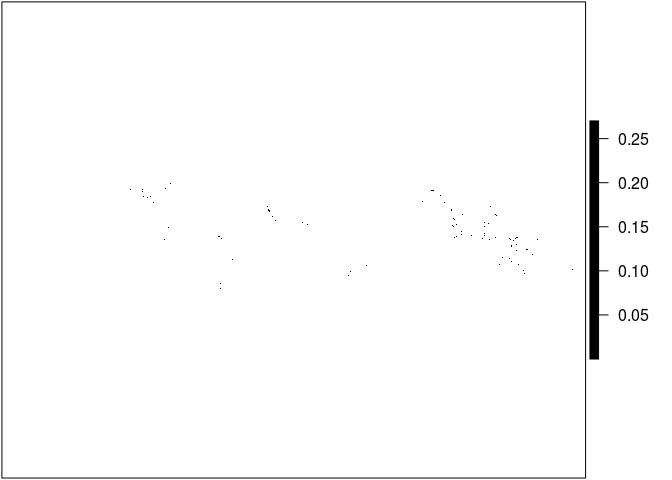
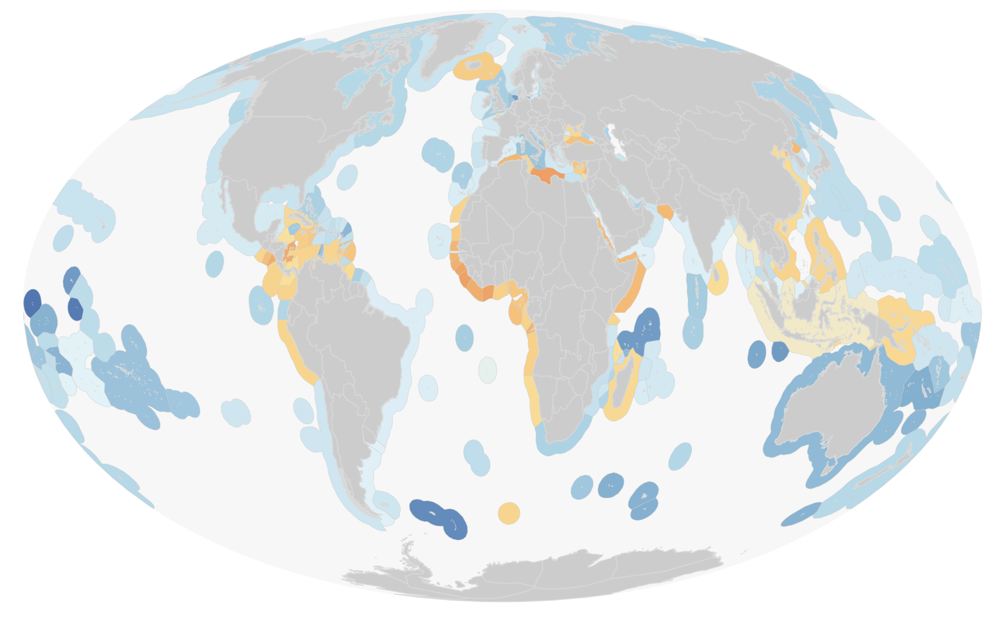
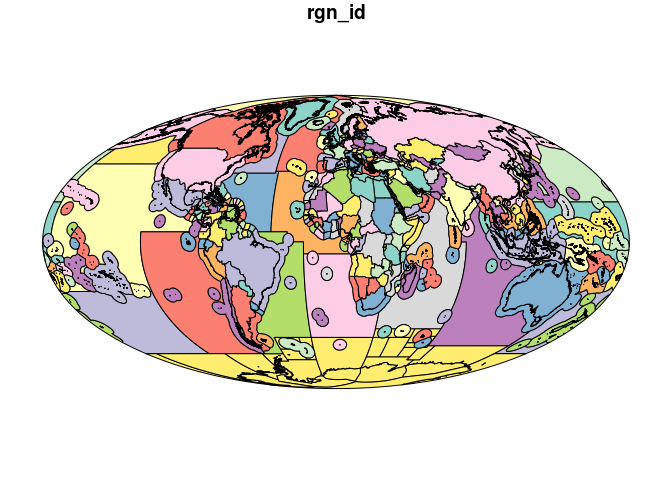
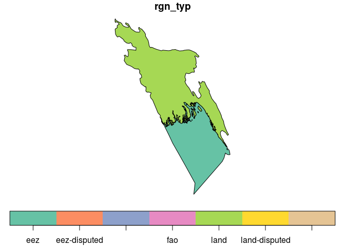
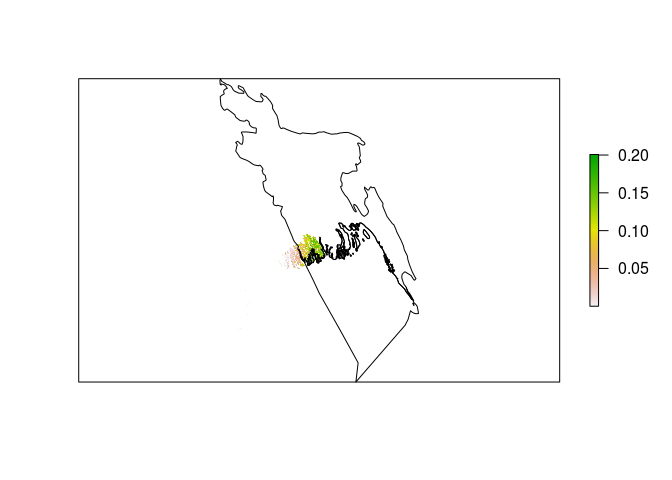
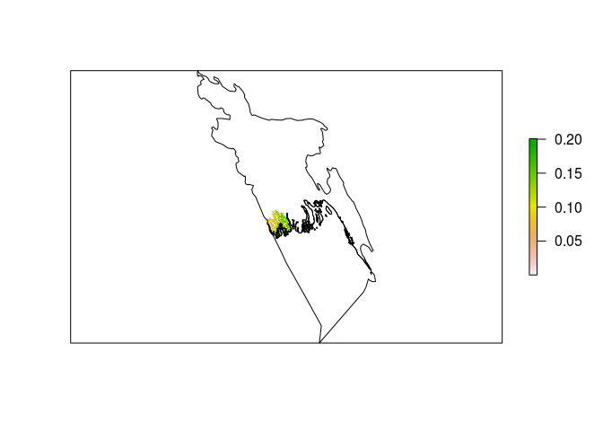

Cropping rasters down to size
================
Jamie Afflerbach
2018-04-26

*This blog post was written for [OHI-Science.org](http://ohi-science.org/)*

A significant portion of my work on the Ocean Health Index (OHI) involves working with [raster data](http://desktop.arcgis.com/en/arcmap/10.3/manage-data/raster-and-images/what-is-raster-data.htm), a specific type of spatial data where values are held in grid cells. The data I work with varies from high resolution, remotely sensed data on [sea surface temperature](https://www.nodc.noaa.gov/sog/cortad/) to coarse, modeled data on global [fish catch](http://www.seaaroundus.org/data/#/spatial-catch). When I was working on the [global assessment](http://ohi-science.org/ohi-global/), I dealt with raster data at a global scale.

*Examples of raster data used in the Ocean Health Index:* 

Now that I am working on a regional assessment in the [US Northeast](http://www.ohi-northeast.org/), I often need to use the same data from the global assessment but cropped to my regional scale. Since I know I am not the only one doing this (we currently have [over 20 OHI+ assessments occurring around the world](http://ohi-science.org/projects/ohi-assessments/)), I wanted to share my process for making our global raster layers usable at regional scales.

To demonstrate how to crop a global raster layer to a regional scale, here are step-by-step instructions you can follow along with on your computer using the programming language R, which we use for OHI assessments. Essentially, we are going to treat a country’s spatial boundaries like a cookie cutter. When we use it on a global mangrove raster layer for the whole world, we will end up with mangrove data only in the shape of the cookie cutter, in a process I've named “crop & mask."

We will do the following:

1.  Read in a global mangrove dataset
2.  Select a single country's spatial boundary from the OHI global region file
3.  `crop` the mangrove data to a *bounding box* equal to the extent of the region
4.  `mask` out the mangrove data to retain only the data within region boundaries

The packages you will need are [`raster`](https://cran.r-project.org/web/packages/raster/vignettes/Raster.pdf), [`sf`](https://r-spatial.github.io/sf/), and [`dplyr`](https://dplyr.tidyverse.org/).

``` r
## load these three packages using the library() function
library(raster)
library(sf)
library(dplyr)
```

Throughout this post, I’ll use the `packagename::function` nomenclature to identify which package functions come from.

Load raster data
----------------

For this blog, I will use a raster that contains global mangrove data. This file is too large to store on our [OHI-Science GitHub account](https://github.com/OHI-Science/), where most of our OHI data is held. Instead, it is stored on a server at NCEAS and can be downloaded [here](https://ohi.nceas.ucsb.edu/data/data/mangrove_2012_mw_km2.tif).

Some important information about this dataset:

> This is a slightly modified version of the “MFW, Mangrove Forest Cover Loss since 2000 in areas with year 2000 Mangrove Forest” dataset from: Hamilton, S. E., & Casey, D. (2016). [Creation of a high spatio-temporal resolution global database of continuous mangrove forest cover for the 21st century (CGMFC-21)](http://faculty.salisbury.edu/~sehamilton/mangroves/index.html). Global Ecology and Biogeography, 25(6), 729-738. <doi:10.1111/geb.1244>.
>
> The raster data is provided at a 30 meter resolution, which is awesome, but it can be difficult to work with due to its large size and time required to process it. To alleviate this problem, we created a ~500 meter resolution raster and converted it to the Mollweide coordinate reference system. The units for these data are area of mangrove per cell in square kilometers. Consequently, summing the raster cells in a region will provide the total area of mangrove forest in km<sup>2</sup> (cell values range from 0 to 0.274979).
>
> The R scripts we used to estimate mangrove extent and trend are available from [GitHub](https://github.com/OHI-Science/ohiprep/tree/master/globalprep/hab_mangrove/v2015).
>
> These data could be useful for estimating mangrove cover in regions without local mangrove surveys.

I have downloaded this data onto my personal computer and saved it in a folder called `big`.

Let's first take a look at the downloaded mangrove data. Since mangroves tend to be limited to coastal regions at tropical latitudes, it is difficult to make sense of this data when visualizing it at a global scale, even when I make all cells black in color. This is also due to the high resolution of the data.

Can you see the dots!?

``` r
## I've saved this raster in a folder called `big` on my personal drive. You will need to replace this file path with where the file is located on your own computer.
mangrove <- raster('/home/afflerbach/big/mangrove_2012_mw_km2.tif')

##setting plot margins
par(mar = c(0.1, 0.1, 0.1, 0.3))
plot(mangrove, col = "black", axes = FALSE)
```



Fortunately, R gives us some options to explore the data more closely. We can zoom in using `raster::select()` to make more sense of the speckles we see currently. The `select()` function allows you to select an area on the plot with your cursor. By saving your selection to a variable (in our case `s`) you can then plot just that piece of the raster.


OK that looks more like it!

Load OHI global regions
-----------------------

We provide a shapefile of 240 global regions including country exclusive economic zones (EEZ) and high seas regions. You are able to load it and select the country(s) of interest for your analyses. This is useful for anyone that wants to use data provided at the global level, but cropped down to a region of interest. You can download the shapefile [here](https://mazu.nceas.ucsb.edu/data/#ohi_regions). Again, this file is too large to host on GitHub so I will download it onto my personal computer and save it in the `big` folder.



Once downloaded, you will have two different regions files, one in a **Mollweide** projection and one in **WGS84**. You can select whichever suits your needs. If you need more information on coordinate reference systems see [here](https://www.nceas.ucsb.edu/~frazier/RSpatialGuides/OverviewCoordinateReferenceSystems.pdf).

Since the mangrove data is already in a Mollweide projection, we will use the regions file in the same projection, `regions_mol`. I am going to use the function `st_read()` to load the shapefile. This comes from the `sf` package and is a preferred method of loading and working with spatial data as opposed to using `readOGR()` from the `rgdal` package. The `st_read()` function will read in the shapefile as a **simple feature** object, meaning the spatial information is stored in a dataframe. This allows you to use data wrangling tools such as `dplyr` to work with the data.

``` r
## use st_read to read in the global regions shapefile as a simple feature object
regions <- st_read("/home/afflerbach/big/regions/regions_mol.shp", quiet = TRUE)
```

The `regions` object is a simple feature with an attribute table in the form of a dataframe that lists some important variables including the type of region (land or EEZ), name, our OHI three-letter key, and total area.

``` r
head(regions)
```

    ## Simple feature collection with 6 features and 7 fields
    ## geometry type:  MULTIPOLYGON
    ## dimension:      XY
    ## bbox:           xmin: 883504 ymin: -1914692 xmax: 16892390 ymax: 458736.6
    ## epsg (SRID):    NA
    ## proj4string:    +proj=moll +lon_0=0 +x_0=0 +y_0=0 +datum=WGS84 +units=m +no_defs
    ##   rgn_typ ant_typ rgn_id ant_id             rgn_nam rgn_key      are_km2
    ## 1     eez     eez      1      1       Cocos Islands     CCK 470116.60060
    ## 2    land    land      1      1       Cocos Islands     CCK     17.94724
    ## 3     eez     eez     10     10               Nauru     NRU 310565.14721
    ## 4    land    land     10     10               Nauru     NRU     22.78557
    ## 5     eez     eez    100    100 Republique du Congo     COG  39863.59682
    ## 6    land    land    100    100 Republique du Congo     COG 346305.36416
    ##                         geometry
    ## 1 MULTIPOLYGON (((9921659.093...
    ## 2 MULTIPOLYGON (((9573533.319...
    ## 3 MULTIPOLYGON (((16870312.59...
    ## 4 MULTIPOLYGON (((16730961.91...
    ## 5 MULTIPOLYGON (((1200386.757...
    ## 6 MULTIPOLYGON (((1172410.299...

Let's plot the object to make sure what we have is what we expect. With simple features, you need to tell `plot()` which column to show, otherwise R will create a plot for every column, which we do not need! Here I am plotting just the `rgn_id` column. When plotting an sf object, you need to plot based on column location, and `rgn_id` is the third column:

``` r
plot(regions[3])
```



OK this looks like what we want!

Select region of interest
-------------------------

For the sake of demonstration, we are going to use Bangladesh as our region of interest. Since we loaded the shapefile as a simple feature object, we can now select Bangladesh using `dplyr::filter()`. When we plot our new object, we see there are two distinct polygons included - the land (lime green) and (teal) eez polygons for Bangladesh.

``` r
# filter the regions you want:
bangladesh <- regions %>% 
  dplyr::filter(rgn_nam == "Bangladesh")

plot(bangladesh[1], key.pos = 1)
```



This looks like what we want, so I recommend saving this object with `st_write()` to use in other parts of your analysis.

``` r
# save the output (saving as an ESRI Shapefile):
sf::write_sf(bangladesh, "data/bangladesh.shp")
```

Crop raster data to region extent
---------------------------------

Unfortunately, rasters (our mangrove data) do not yet play nicely with simple feature objects (our region shapefile), so we need to convert the `bangladesh` object to a `SpatialPolygonsDataFrame`. This is done using `as()`. You pass your simple feature object - in our case `bangladesh` - to `as()` and tell it to convert to a `Spatial` object. This returns the same polygons but as a `SpatialPolygonsDataFrame`.

``` r
bang_sp <- as(bangladesh, 'Spatial')
bang_sp
```

    ## class       : SpatialPolygonsDataFrame 
    ## features    : 2 
    ## extent      : 8265652, 8898467, 2280053, 3246484  (xmin, xmax, ymin, ymax)
    ## coord. ref. : +proj=moll +lon_0=0 +x_0=0 +y_0=0 +datum=WGS84 +units=m +no_defs +ellps=WGS84 +towgs84=0,0,0 
    ## variables   : 7
    ## names       : rgn_typ, ant_typ, rgn_id, ant_id,    rgn_nam, rgn_key,   are_km2 
    ## min values  :     eez,     eez,    204,    204, Bangladesh,     BGD, 139812.14 
    ## max values  :    land,    land,    204,    204, Bangladesh,     BGD,  84563.26

In a `SpatialPolygonsDataFrame`, attribute data is stored as a `data.frame` in the data slot, but the actual geometric features are stored in a polygons slot. This structure can be confusing to work with but until the `raster` package improves compatibility with `sf` objects, it is necessary to use `SpatialPolygonsDataFrames` with the `raster` package.

Now we can use `bang_sp` to get the mangrove data that we are interested in, which is all mangrove habitat within the borders of Bangladesh. This requires two steps:
1. `raster::crop()`
2. `raster::mask()`

After trial and error I have determined that these two steps, in this order, is the fastest way to get the data we want. By first using the `crop()` function, we crop the `mangrove` raster dataset to a *bounding box* equal to the extent of the `bang_sp` object. I think of this as a way to zoom into the dataset so we only see what's in our region of interest. But this still returns data that falls outside of Bangladesh:

``` r
bang_man <- raster::crop(mangrove, bang_sp)
plot(bang_man, axes = FALSE)
plot(bang_sp, add = TRUE, box = FALSE, axes = FALSE)
```



You can see that `bang_man` is a scaled down version of the mangrove data, only showing us what mangrove data exists within the *bounding box* of the Bangladesh polygon. To remove the data that falls outside of the country boundary, we now need to use `raster::mask()`. This function uses a `SpatialPolygonsDataFrame` as a "cookie cutter" and keeps only the raster data that falls within the polygon.

``` r
bang_man_mask <- raster::mask(bang_man, bang_sp)
plot(bang_man_mask, axes = FALSE)
plot(bang_sp, add = TRUE)
```



Now that we have the data we want, mangrove data for Bangladesh, we can save this data using `writeRaster()`.

``` r
writeRaster(bang_man_mask, filename = "bangladesh_mangrove_data.tif")
```

For a more thorough tutorial on working with raster data see my [*Intro to Spatial Analysis in R*](http://jafflerbach.github.io/spatial-analysis-R/).

Happy cropping!
